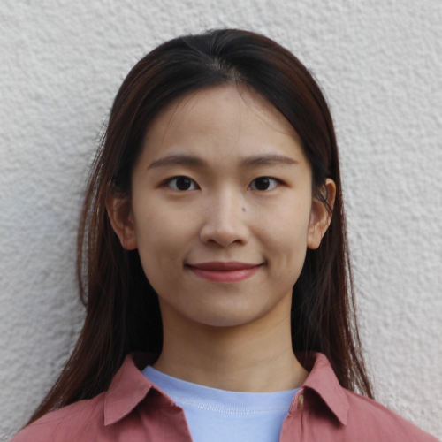

I have been a postdoctoral researcher at UC Berkeley since last September, serving as a senior postdoc and contributing to multiple projects aimed at deepening our understanding of ecosystem functions and disturbances. Previously, I worked as a postdoc at the Max Planck Institute for Biogeochemistry in the Department of Biogeochemical Integration starting in February 2023. I completed my Ph.D. at the same institute, successfully defending my thesis with distinction in June 2023.

I was born in a small city in eastern China, where I often observed the human impact on the environment. During my time on campus in China, I participated in various environmental protection projects—including winter bird habitat assessments, mangrove forest restoration, urbanisation and historical heritage trade-off studies, and pollution investigations in marinated onion production. These experiences motivated me to pursue a career focused on understanding the impacts of global change and mitigating climate risks.

My Ph.D. work focused on remote sensing vegetation monitoring using multiple indicators (vegetation greenness, SIF, LST, VOD) to analyze long-term responses to water limitation and extreme environmental conditions (such as deficits in soil moisture and terrestrial water storage) and vegetation feedbacks. I also conducted analyses of land surface and Earth system model outputs, along with eddy covariance measurements of carbon and energy fluxes.

My first postdoctoral project introduced a new dimension by incorporating socio-economic change. I developed a framework that summarizes socio-economic shifts closely linked to biospheric and atmospheric variability. This framework facilitates comprehensive tracking of planetary and compound extreme threats and guides sustainable development strategies.

Currently, I am testing two main avenues: (i) radiative transfer and plant physiology modeling, and (ii) analyzing GEDI monitoring archives, to investigate ecosystem responses to and recovery from various disturbances, starting with drought extremes. As a part-time exploration, I regularly mentor a MSc student to statistically analyze the global economic impacts of climate change while doing some codes by myself to try to understand how AI can advance economic damage prevention.
