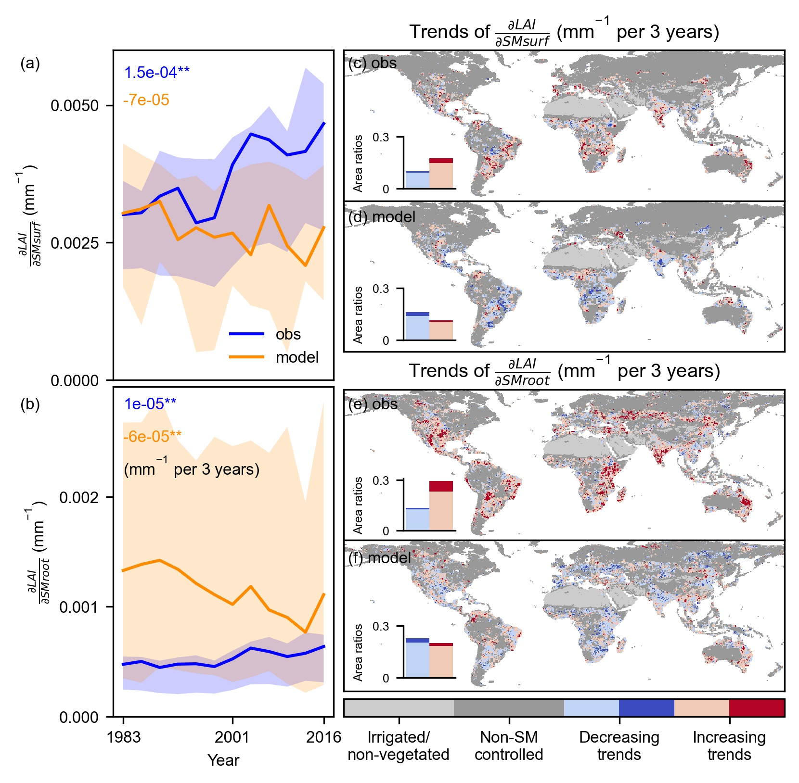
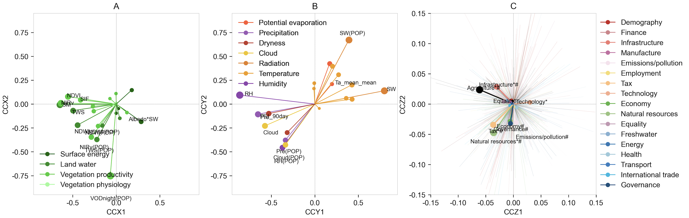
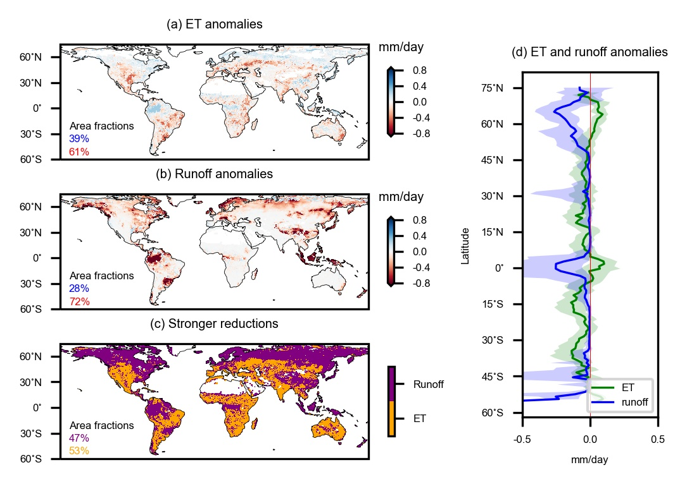
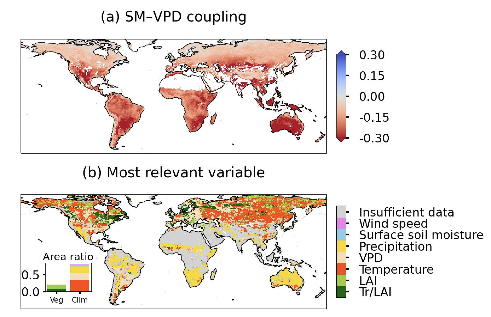

---

## Research related to terrestrial vegetation monitoring and satellite remote sensing

**1. Widespread and complex drought effects on vegetation physiology**
We synthesised satellite remote sensing observations (i.e., leaf area index, sun-induced fluorescence, land surface temperature, vegetation optical depth) to quantify the effect of drought on vegetation physiology. Using machine learning and the Soil Canopy Observation of Photochemistry and Energy flux (SCOPE) model, this study found strong vegetation physiology decoupling with canopy structure in humid ecosystems. Quantifying drought impacts on the terrestrial carbon sink needs to carefully account for vegetation physiological variability.

**Publication:**
[Li, W., Pacheco-Labrador, J., Migliavacca, M., Miralles, D., Heok van Dijke, A., Reichstein, M., Forkel, M., Zhang, W., Frankenberg, C., Panwar, A., Zhang, Q., Weber, U., Gentine, P. & Orth, R. (2023). Widespread and complex drought effects on vegetation physiology inferred from space. Nature Communications, 14(4640).](https://www.nature.com/articles/s41467-023-40226-9)

  
  <em></em>

**2. Widespread increasing vegetation sensitivity to soil moisture**
This study quantified the sensitivity of vegetation leaf area index to near- and sub-surface soil moisture using ensemble observations and land surface models and found a widespread increase in sensitivity from observations due to ecosystem vulnerability and precipitation deficits. This study illustrated a non-linearity of vegetation responses to soil moisture variability and unravelled the discrepancy in land surface modelling. Another contributing study of mine found similar increasing water limitation for future scenarios (Denissen et al., Nat. Clim. Change. DOI: 10.1038/s41558-022-01403-8).

**Publication:**
[Li, W., Migliavacca, M., Forkel, M., Denissen, J., Reichstein, M., Yang, H., Duveiller, G., Weber, U. & Orth, R. (2022). Widespread increasing vegetation sensitivity to soil moisture. Nature Communications, 13, 3959.](https://doi.org/10.1038/s41467-022-31667-9)

**Figure:** 

**3. Syndromes of biosphere-atmosphere-socioeconomic change**
This perspective paper offers a data-driven approach to monitoring, integrating, and diagnosing the dynamic changes between the biosphere, atmosphere, and socioeconomics activities. By employing an interactive dimensionality reduction approach and dozens of Earth observations, we presented a prototype and summarized main interactions as natural ecosystem and urban syndromes. The integrated main biospheric, atmospheric, and socioeconomic changes can help to identify influential extreme events for risk assessment and enhancing early warning capabilities.

**Publication:**
[Li, W., Duveiller, G., Gans, F., Smits, J., Kraemer, G., Frank, D., Mahecha, M.D., Weber, U., Migliavacca, M., Ceglar, A. Keenan, T.F. & Reichstein, M. (2025). Diagnosing syndromes of biosphere-atmosphere-socioeconomic change (Preprint).](https://doi.org/10.48550/arXiv.2503.08874)

**Figure:** 

## Research related to vegetation-atmosphere interactions
**1. Drought propagation into the terrestrial water cycle**
Significance: This study investigated the global propagation of soil drought in the hydrosphere blue water (runoff) and biosphere green water fluxes (land evaporation) and found contrasting drought responses between evaporation and runoff and between dry and wet regions. Land surface models overestimate the drought-induced evaporation deficits due to inadequate modelling of soil-water interplay. The initial analysis of this work was carried out by a MSc student whom I co-supervised, and after the successful master defense I took over the study and continued the work to complete the study.

**Publication:**
[Li, W., Reichstein, M., O, S., May, C., Destouni, G., Migliavacca, M., Kraft, B., Weber, U. & Orth, R. (2023). Contrasting drought propagation into the terrestrial water cycle between dry and wet regions. Earth's Future, 11, e2022EF003441.](https://doi.org/10.1029/2022EF003441)

**Figure:** 

**2. Vegetation Structure and Physiology on Land–Atmosphere Coupling**
This study investigated the global propagation of soil drought in the hydrosphere blue water (runoff) and biosphere green water fluxes (land evaporation) and found contrasting drought responses between evaporation and runoff and between dry and wet regions. Land surface models overestimate the drought-induced evaporation deficits due to inadequate modelling of soil-water interplay. The initial analysis of this work was carried out by a MSc student whom I co-supervised, and after the successful master defense I took over the study and continued the work to complete the study.

**Publication:**
[Li, W., Migliavacca, M., Miralles, D. G., Reichstein, M., Anderegg, W. R., Yang, H., & Orth, R. (2025). Disentangling Effects of Vegetation Structure and Physiology on Land–Atmosphere Coupling. Global Change Biology, 31(1), e70035.](https://doi.org/10.1111/gcb.70035)

**Figure:** 

**3. Global carbon and water cycles and vegetation dynamics**
This review synthesizes recent advances in monitoring vegetation dynamics, emphasizing the critical roles of structure and physiology in regulating global carbon and water cycles. It advocates integrating satellite remote sensing, in-situ measurements, and modelling to enhance our understanding of vegetation responses to global change, ultimately improving predictions of terrestrial ecosystem feedback.

**Publication:**
[Li, W., Duveiller, G., Wieneke, S., Forkel, M., Gentine, P., Reichstein, M., Niu, S., Migliavacca, M. & Orth, R. (2024). Regulation of the global carbon and water cycles through vegetation structural and physiological dynamics. Environ. Res. Lett. 19 073008.](https://doi.org/10.1088/1748-9326/ad5858)

